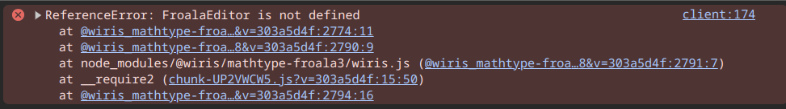

# Vue + Froala + Wiris 

I followed these setup guides: 

* https://froala.com/wysiwyg-editor/docs/framework-plugins/vue-js-3/
* https://froala.com/blog/editor/tutorials/how-to-integrate-froala-with-vue-3/
* https://froala.com/wysiwyg-editor/examples/wiris/
* https://docs.wiris.com/mathtype/en/mathtype-integrations/mathtype-for-html-editors/mathtype-for-froala.html

I managed to get Froala to work just fine, however the wiris integration seems to break Froala: 

Removing the wiris import (`HomeView.vue:18 import "@wiris/mathtype-froala3/wiris";`) shows that froala itself is working 

